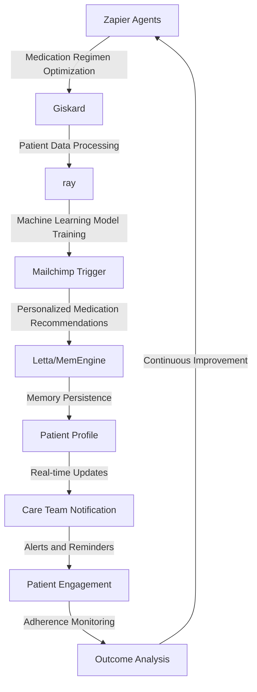

# Optimizing Personalized Medication Regimens for Geriatric Patients with Polypharmacy
> "Revolutionizing Geriatric Care through AI-Driven Medication Optimization"

## 🏗️ Technical Architecture & Multi-Agent Flow
The technical architecture of this project is centered around a multi-agent system, leveraging the capabilities of Zapier Agents, Giskard, ray, and Mailchimp Trigger. The following Mermaid.js diagram illustrates the complex interactions between these components:

This diagram demonstrates the state transitions, memory persistence, and tool calling that enable the optimization of personalized medication regimens for geriatric patients with polypharmacy.

## 🔍 The Vertical Bottleneck: Polypharmacy-Induced Medication Errors
Polypharmacy, or the concurrent use of multiple medications, is a pervasive issue in geriatric care, leading to an increased risk of medication errors, adverse drug reactions, and decreased patient outcomes. The technical friction arises from the complexity of medication regimens, the multitude of potential drug interactions, and the need for real-time monitoring and adjustments. High-stakes mathematical or operational failures can occur when healthcare providers struggle to keep pace with the dynamic nature of polypharmacy, resulting in suboptimal medication management and compromised patient care.

The polypharmacy-induced medication error bottleneck is further exacerbated by the lack of standardized protocols, inadequate communication among care team members, and the limited availability of personalized medication optimization tools. The consequences of these failures can be severe, including increased morbidity, mortality, and healthcare costs.

The intricacies of polypharmacy demand a sophisticated, AI-driven approach to medication optimization, one that can navigate the complexities of medication regimens, account for individual patient factors, and provide real-time guidance to healthcare providers. The development of such a system requires a deep understanding of the technical and operational challenges inherent to polypharmacy, as well as the integration of cutting-edge technologies, including machine learning, natural language processing, and multi-agent systems.

## 💡 The Solution: Polypharmacy Optimization Platform
The Polypharmacy Optimization Platform is designed to address the technical and operational challenges of polypharmacy, providing a comprehensive solution for personalized medication regimen optimization. By orchestrating Zapier Agents, Giskard, ray, and Mailchimp Trigger, this platform enables the creation of customized medication plans, tailored to the unique needs of each patient.

The platform's agentic reasoning capabilities allow it to analyze patient data, medication regimens, and potential drug interactions, providing real-time recommendations for medication adjustments and optimizations. The memory usage and persistence are ensured through the integration with Letta/MemEngine, enabling the platform to learn from patient outcomes and adapt to changing medication regimens.

## 🧩 Agentic Stack Deep-Dive
The Polypharmacy Optimization Platform's agentic stack is composed of several key components, each contributing to the overall functionality and performance of the system. Zapier Agents provide the foundation for medication regimen optimization, leveraging their ability to integrate with various healthcare applications and services.

Giskard, a state-of-the-art machine learning framework, enables the platform to analyze patient data and medication regimens, identifying potential drug interactions and optimizing medication plans. Ray, a high-performance distributed computing platform, facilitates the training of machine learning models, ensuring that the platform can scale to meet the demands of large patient populations.

Mailchimp Trigger, a powerful automation tool, allows the platform to send personalized notifications and reminders to patients and care team members, promoting adherence to optimized medication regimens. The integration of these components enables the platform to provide a comprehensive solution for polypharmacy optimization, addressing the technical and operational challenges inherent to this complex problem.

## ✨ Capabilities & Features
The Polypharmacy Optimization Platform offers a range of capabilities and features, including:
* **Medication Regimen Optimization**: Personalized medication plans tailored to individual patient needs
* **Real-time Recommendations**: Continuous monitoring and adjustments to medication regimens
* **Patient Data Analysis**: In-depth analysis of patient data, including medical history, lab results, and medication use
* **Machine Learning Model Training**: Advanced machine learning models trained on large patient datasets
* **Automated Notifications**: Personalized notifications and reminders for patients and care team members
* **Care Team Collaboration**: Secure, real-time communication and collaboration among care team members
* **Patient Engagement**: Patient-facing interface for medication adherence monitoring and education
* **Outcome Analysis**: Continuous analysis of patient outcomes, enabling data-driven decision-making
* **Scalability**: High-performance distributed computing platform for large patient populations
* **Security**: Robust security measures, including data encryption and access controls

## 🛠️ Technical Implementation
The technical implementation of the Polypharmacy Optimization Platform involves a range of programming languages, frameworks, and tools. The platform's core logic is written in Python, leveraging the Zapier Agents API for medication regimen optimization and the Giskard framework for machine learning model training.

The platform's user interface is built using a combination of HTML, CSS, and JavaScript, providing an intuitive and user-friendly experience for patients and care team members. The Mailchimp Trigger API is used for automated notifications and reminders, while the Ray platform enables high-performance distributed computing for large patient datasets.

## 📊 Business Impact & ROI
The Polypharmacy Optimization Platform has the potential to significantly impact the business of nursing and residential care, reducing medication errors, improving patient outcomes, and decreasing healthcare costs. By optimizing medication regimens and promoting adherence, the platform can help healthcare providers reduce readmissions, minimize adverse drug reactions, and enhance patient satisfaction.

The return on investment (ROI) for the platform can be substantial, with potential cost savings ranging from 10% to 30% of total healthcare expenditures. Additionally, the platform can help healthcare providers improve their quality metrics, enhance their reputation, and increase patient loyalty.

## 🚀 Getting Started
To get started with the Polypharmacy Optimization Platform, follow these steps:
```bash
git clone https://github.com/arvind-sundararajan/polypharmacy-optimization.git
cd polypharmacy-optimization
pip install -r requirements.txt
python src/main.py
```
This will install the necessary dependencies, clone the repository, and run the platform's core logic.

## 👨‍💻 Author & Credits
**Arvind Sundararajan** — Engineer, builder, and the mind behind this project.
🌐 [LinkedIn](https://www.linkedin.com/in/arvind-sundara-rajan/) | Chennai, India

---
### 🙏 Acknowledgements
- The open-source community
- The Nursing & Residential Care practitioners who inspired this design